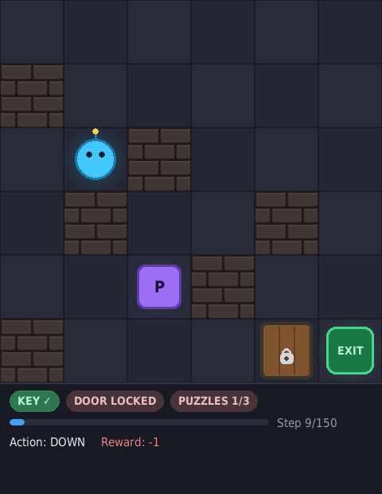
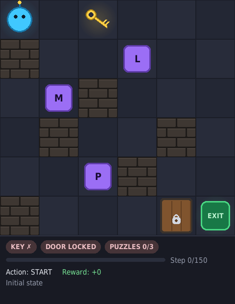
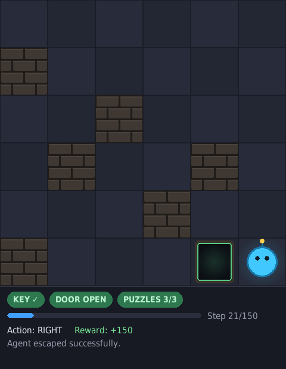
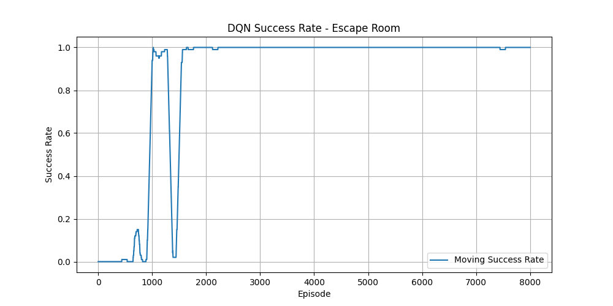
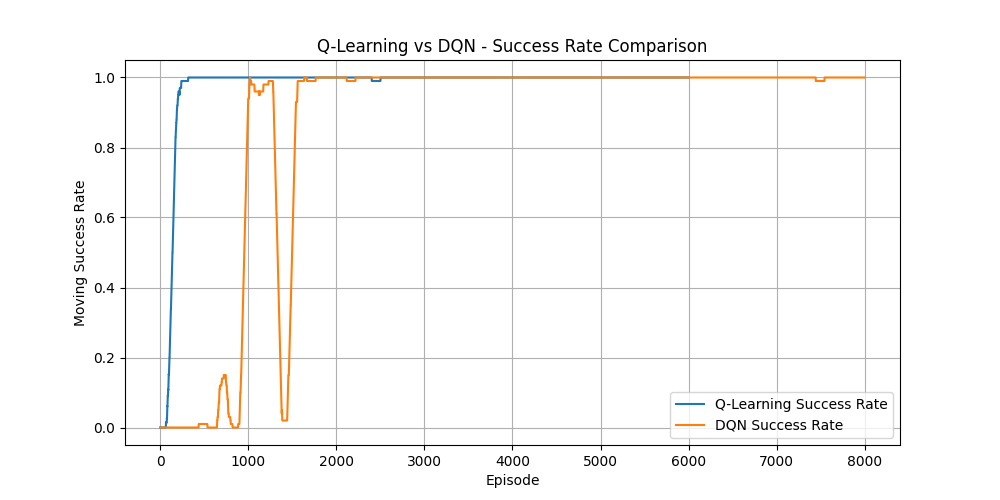

# Escape Room ML Agent


A Reinforcement Learning project where an agent learns to escape a grid-world escape room: collect the key, solve the puzzles, unlock the door and reach the exit. Two agents are implemented and compared — **tabular Q-Learning** and a **Deep Q-Network (DQN)** — on both a fixed room and randomized multi-level layouts.

Developed as part of my diploma thesis: *Puzzle Solving with Machine Learning*.

<p align="center">
  
</p>

## Highlights

- Custom escape-room environment with a Gym-like `reset()` / `step()` API
- Two RL agents: tabular Q-Learning (NumPy) and DQN with experience replay and a target network (PyTorch)
- Fixed-level and randomized multi-level training, with level layouts defined in JSON
- Automatic map validation (BFS reachability checks for key, puzzles, door and exit)
- Pygame visualization of trained agents, plus a manual play mode
- Full experiment pipeline: training stats to CSV, charts with Matplotlib, agent comparison reports

## Demo

| Start | Mid-episode | Escaped |
|---|---|---|
|  |  |  |

The HUD shows live episode status: key possession, door state, puzzles solved and a step-budget progress bar.

## How it works

The problem is modeled as an episodic RL task. In every episode the agent starts from a fixed position and must discover the escape sequence on its own:

```text
Start → Key → Puzzles → Door → Exit
```

**State** — `(row, col, has_key, solved_puzzle_1..3, door_open)`, optionally extended with a `level_id` for multi-level training.

**Actions** — `UP`, `DOWN`, `LEFT`, `RIGHT`, `PICK_KEY`, `SOLVE_PUZZLE`, `OPEN_DOOR`.

**Rewards** — small step penalty (−1), penalties for invalid actions (−5 to −10), positive rewards for milestones: key +15, each puzzle solved, door opened +40, escape +150. The door only opens if the agent holds the key *and* has solved all puzzles, which forces the agent to learn a long-horizon, ordered strategy.

## Project structure

```text
escape-room-ml-agent/
├── main.py                     # Interactive menu for all experiments
├── train.py                    # Train Q-Learning (fixed level)
├── evaluate.py                 # Evaluate Q-Learning (fixed level)
├── train_dqn.py                # Train DQN (fixed level)
├── evaluate_dqn.py             # Evaluate DQN (fixed level)
├── compare_agents.py           # Q-Learning vs DQN comparison (fixed level)
├── train_random_levels.py      # Train either agent on randomized levels
├── evaluate_random_levels.py   # Evaluate on all levels
├── compare_random_levels.py    # Multi-level comparison report
├── visualize.py                # Watch a trained agent play (Pygame)
├── manual_play.py              # Play the room yourself (Pygame)
├── config/
│   ├── puzzles.json
│   └── levels/                 # Level layouts (JSON)
├── environment/                # EscapeRoomEnv + puzzles
├── agents/                     # QLearningAgent, DQNAgent
├── ui/                         # Pygame visualizer
├── models/                     # Pre-trained models (ready to run)
└── results/                    # Training stats, charts, evaluation CSVs
```

## Installation

```bash
git clone https://github.com/<your-username>/escape-room-ml-agent.git
cd escape-room-ml-agent

python -m venv .venv
source .venv/bin/activate        # Windows: .venv\Scripts\activate

pip install -r requirements.txt
```

## Quick start

Pre-trained models are included, so you can watch an agent escape immediately:

```bash
python visualize.py --agent q                # trained Q-Learning agent, level 1
python visualize.py --agent dqn --level 3    # multi-level DQN on the hardest room
python manual_play.py                        # play it yourself
```

The right model is picked automatically: level 1 uses the fixed-level model, while levels 2 and 3 load the multi-level model trained on randomized layouts.

Or use the interactive menu that exposes every experiment:

```bash
python main.py
```

## Training and evaluation

Fixed level:

```bash
python train.py                 # → models/q_table_fixed.pkl
python evaluate.py
python train_dqn.py             # → models/dqn_fixed.pth
python evaluate_dqn.py
python compare_agents.py        # → results/comparison_summary.csv + charts
```

Randomized levels (agent trains across all layouts in `config/levels/`):

```bash
python train_random_levels.py --agent q    --episodes 9000
python train_random_levels.py --agent dqn  --episodes 12000
python evaluate_random_levels.py --agent q
python evaluate_random_levels.py --agent dqn
python compare_random_levels.py
```

## Results

Both agents converge to a reliable escape policy on the fixed level (average over the final 100 training episodes):

| Agent | Success rate | Avg. reward | Avg. steps |
|---|---|---|---|
| Q-Learning | 100% | 262.2 | 21.9 |
| DQN | 100% | 262.5 | 21.6 |

On randomized levels both agents also reach a 100% evaluation success rate across all layouts, with DQN achieving a slightly higher average reward (261 vs 248).

Because evaluation uses a greedy (no-exploration) policy in a deterministic environment, the trained agents escape every level in the exact same number of steps on every run — 120/120 wins in a stress test across all agent/level combinations (21 steps on level 1, 25 on level 2, 27–29 on level 3).

| Training curves | Q-Learning vs DQN |
|---|---|
|  |  |

All training statistics, evaluation CSVs and charts are stored in `results/`.

## Level format

Levels are plain JSON files, so new rooms can be added without touching the code:

```json
{
  "level_id": 1,
  "level_name": "Classic Escape Room",
  "rows": 6,
  "cols": 6,
  "start_position": [0, 0],
  "key_position": [2, 4],
  "door_position": [4, 0],
  "exit_position": [5, 0],
  "walls": [[1, 1], [1, 2]],
  "puzzles": [
    {
      "id": "math_1",
      "symbol": "M",
      "question": "5 + 7",
      "answer": "12",
      "reward": 20,
      "position": [3, 2]
    }
  ]
}
```

Every level is validated on load with BFS reachability checks: the key and all puzzles must be reachable before the door opens, and the exit must be reachable after.

## Tech stack

Python, NumPy, Pandas, Matplotlib, PyTorch, Pygame.

## License

MIT — see [LICENSE](LICENSE).
